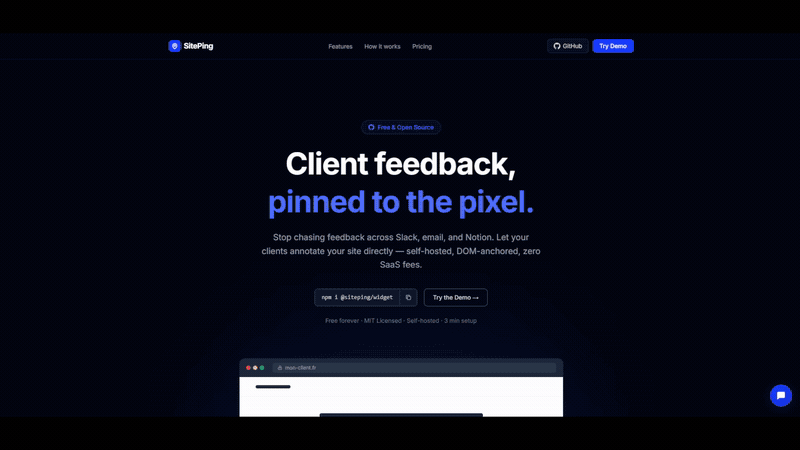

<div align="center">

<h1>SitePing</h1>

**Client feedback, pinned to the pixel.**

A lightweight feedback widget that lets your clients annotate websites during development.
Draw rectangles, leave comments, track bugs — directly on the live site.



[](https://siteping.dev)
[](https://siteping.dev/demo)
[](https://www.npmjs.com/package/@siteping/widget)
[](https://www.npmjs.com/package/@siteping/widget)
[](./LICENSE)
[](https://github.com/NeosiaNexus/SitePing/actions)
[](https://www.typescriptlang.org/)
[](https://bundlephobia.com/package/@siteping/widget)

[Getting Started](#getting-started) &middot; [Configuration](#configuration) &middot; [API Reference](#api-reference) &middot; [CLI](#cli) &middot; [Architecture](#architecture)

</div>

> **[See SitePing in action →](https://siteping.dev/demo)** — Draw annotations, leave feedback, track bugs directly on the live site.

---

## Why SitePing?

Stop chasing client feedback across Slack threads, email chains, and Notion docs. SitePing gives your clients a **contextual** way to leave feedback — anchored to the exact element they're looking at.

### SitePing vs. the alternatives

| | SitePing | Marker.io | BugHerd |
|---|---|---|---|
| **Self-hosted** | Yes — your DB, your data | No (SaaS) | No (SaaS) |
| **npm package** | `npm install` and go | npm + script tag | Script tag only |
| **Framework-native** | First-class Next.js support | Framework-agnostic | Framework-agnostic |
| **Pricing** | Free & open source | From $39/mo | From $42/mo |
| **DOM-anchored annotations** | Multi-selector (CSS + XPath + text) | Screenshot-based | Pin-based |
| **Annotations survive layout changes** | Yes (percentage-relative rects) | No (pixel coordinates) | Partially |
| **Customizable** | Full control (accent color, position, events) | Limited | Limited |

---

## Features

- **Rectangle annotations** — Clients draw directly on the page, with category + message
- **DOM-anchored persistence** — Annotations are tied to elements, not pixels. They survive layout changes
- **Shadow DOM isolation** — Widget CSS never leaks into your site, and your site CSS never breaks the widget
- **Radial menu** — Clean FAB with expandable actions (chat, annotate, toggle)
- **Feedback panel** — Searchable, filterable history with type chips and resolve/unresolve
- **Smart tooltips** — Hover a marker to preview, click to open the panel
- **Retry with backoff** — Failed submissions are queued in localStorage and retried automatically
- **Zero config auth** — Clients identify once (name + email), persisted locally
- **Full event system** — `onOpen`, `onClose`, `onFeedbackSent`, `onError`, `onAnnotationStart`, `onAnnotationEnd`
- **CLI scaffold** — `npx @siteping/cli init` sets up Prisma schema + API route
- **Monorepo** — Split into independent packages (`widget`, `adapter-prisma`, `adapter-memory`, `adapter-localstorage`, `cli`)
- **Dev-only by default** — Widget auto-hides in production unless `forceShow: true`
- **Lightweight** — ~23KB gzipped

---

## Getting Started

### 1. Install

```bash
npm install @siteping/widget
# or
bun add @siteping/widget
```

### 2. Run the CLI

```bash
npx @siteping/cli init
```

This will:
- Add `SitepingFeedback` and `SitepingAnnotation` models to your `prisma/schema.prisma`
- Generate an API route at `app/api/siteping/route.ts`

Then push the schema:

```bash
npx prisma db push
```

### 3. Add the widget

```tsx
// app/layout.tsx (or any client component)
'use client'

import { initSiteping } from '@siteping/widget'
import { useEffect } from 'react'

export default function Layout({ children }: { children: React.ReactNode }) {
  useEffect(() => {
    const { destroy } = initSiteping({
      endpoint: '/api/siteping',
      projectName: 'my-project',
    })
    return destroy
  }, [])

  return <html><body>{children}</body></html>
}
```

#### Vanilla JS / Any framework

```html
<script type="module">
  import { initSiteping } from '@siteping/widget'

  const widget = initSiteping({
    endpoint: '/api/siteping',
    projectName: 'my-project',
    forceShow: true,
  })

  // Clean up when needed
  // widget.destroy()
</script>
```

The widget is framework-agnostic — it works with React, Vue, Svelte, Astro, or plain HTML.

That's it. Your clients can now draw rectangles on the site and leave feedback.

---

## Configuration

```ts
initSiteping({
  // Required (one of endpoint or store)
  endpoint: '/api/siteping',      // Your API route (HTTP mode)
  // OR
  store: new LocalStorageStore(), // Direct store (client-side mode, no server)
  projectName: 'my-project',      // Scopes feedbacks to this project

  // Optional
  position: 'bottom-right',       // 'bottom-right' | 'bottom-left'
  accentColor: '#0066ff',         // Widget accent color
  theme: 'light',                 // 'light' | 'dark' | 'auto'
  locale: 'en',                   // 'en' | 'fr' (default: 'en')
  forceShow: false,               // Show in production? Default: false
  debug: false,                   // Enable debug logging

  // Events
  onOpen: () => {},
  onClose: () => {},
  onFeedbackSent: (feedback) => {},
  onError: (error) => {},
  onAnnotationStart: () => {},
  onAnnotationEnd: () => {},
  onSkip: (reason) => {},         // Called when widget is skipped (production/mobile)
})
```

### Return value

```ts
const widget = initSiteping({ ... })

widget.open()       // Open the feedback panel
widget.close()      // Close the feedback panel
widget.refresh()    // Refresh feedbacks from the server
widget.destroy()    // Remove the widget and clean up all DOM elements + listeners

// Event listeners (alternative to config callbacks)
const unsub = widget.on('feedback:sent', (feedback) => { ... })
unsub()             // Unsubscribe
widget.off('feedback:sent', handler)

// All public events:
// 'feedback:sent'    — fired after a feedback is successfully submitted
// 'feedback:deleted' — fired after a feedback is deleted (receives feedback id)
// 'panel:open'       — fired when the feedback panel opens
// 'panel:close'      — fired when the feedback panel closes
```

---

## API Reference

### Server adapter

The adapter handles all API logic — validation, persistence, error handling.

```ts
// app/api/siteping/route.ts
import { createSitepingHandler } from '@siteping/adapter-prisma'
import { prisma } from '@/lib/prisma'

export const { GET, POST, PATCH, DELETE, OPTIONS } = createSitepingHandler({ prisma })
```

> **Note:** The handler does not include rate limiting. Consider adding rate limiting middleware in production.

#### Endpoints

| Method | Description | Status |
|--------|-------------|--------|
| `POST` | Create a feedback with annotations | `201` with full feedback object |
| `GET` | List feedbacks (filterable by type, status, search) | `200` with `{ feedbacks, total }` |
| `PATCH` | Resolve or unresolve a feedback | `200` with updated feedback |
| `DELETE` | Delete a feedback or all feedbacks for a project | `200` with `{ deleted: true }` |

#### Query parameters (GET)

| Param | Type | Description |
|-------|------|-------------|
| `projectName` | `string` | **Required.** Filter by project |
| `type` | `string` | Filter: `question`, `change`, `bug`, `other` |
| `status` | `string` | Filter: `open`, `resolved` |
| `search` | `string` | Full-text search on message content |
| `page` | `number` | Pagination (default: 1) |
| `limit` | `number` | Items per page (default: 50, max: 100) |

### Prisma schema

The CLI generates these models automatically. If you prefer manual setup:

```prisma
model SitepingFeedback {
  id          String   @id @default(cuid())
  projectName String
  type        String   // question | change | bug | other
  message     String
  status      String   @default("open")
  url         String
  viewport    String
  userAgent   String
  authorName  String
  authorEmail String
  clientId    String   @unique
  resolvedAt  DateTime?
  createdAt   DateTime @default(now())
  updatedAt   DateTime @updatedAt
  annotations SitepingAnnotation[]
}

model SitepingAnnotation {
  id               String   @id @default(cuid())
  feedbackId       String
  feedback         SitepingFeedback @relation(fields: [feedbackId], references: [id], onDelete: Cascade)
  cssSelector      String
  xpath            String
  textSnippet      String
  elementTag       String
  elementId        String?
  textPrefix       String
  textSuffix       String
  fingerprint      String
  neighborText     String
  xPct             Float
  yPct             Float
  wPct             Float
  hPct             Float
  scrollX          Float
  scrollY          Float
  viewportW        Int
  viewportH        Int
  devicePixelRatio Float    @default(1)
  createdAt        DateTime @default(now())
}
```

---

## CLI

```bash
npx @siteping/cli init
```

Interactive setup that:

1. Detects your `prisma/schema.prisma` file
2. Merges the Siteping models (idempotent — safe to run multiple times)
3. Generates the Next.js App Router API route

---

## Architecture

```
HTTP mode (endpoint)                Client-side mode (store)
                                    
Browser              Server         Browser
  |                    |              |
  |  initSiteping()    |              |  initSiteping({ store })
  |  Widget ────────>  |              |  Widget ── StoreClient
  |                    |              |               |
  |  POST /api/siteping|              |       LocalStorageStore
  |  ───────────────>  |              |       or MemoryStore
  |                    |              |
  |  Handler           |              |  No server needed
  |    Zod validation  |              |
  |    Prisma / Store  |              |
  |  <── 201 ────────  |              |
```

### Key design decisions

- **Shadow DOM (closed)** — Widget styles are fully isolated from the host page
- **Overlay outside Shadow DOM** — The annotation overlay and markers live in the main DOM to avoid clipping from `overflow:hidden` containers
- **Multi-selector anchoring** — Each annotation stores a CSS selector ([`@medv/finder`](https://github.com/antonmedv/finder)), XPath, and text snippet. Re-anchoring tries all three in order, inspired by [Hypothesis](https://web.hypothes.is/blog/fuzzy-anchoring/)
- **Percentage-relative rectangles** — Annotation positions are stored as fractions of the anchor element's bounding box, so they survive responsive layout changes
- **Event bus with error isolation** — User callbacks (`onError`, etc.) cannot crash internal widget logic

### Packages

| Package | Platform | Description |
|---------|----------|-------------|
| [`@siteping/widget`](https://www.npmjs.com/package/@siteping/widget) | Browser | Widget: `initSiteping()` |
| [`@siteping/adapter-prisma`](https://www.npmjs.com/package/@siteping/adapter-prisma) | Node.js | Server: `createSitepingHandler()` |
| [`@siteping/adapter-memory`](https://www.npmjs.com/package/@siteping/adapter-memory) | Any | In-memory store (testing, demos, serverless) |
| [`@siteping/adapter-localstorage`](https://www.npmjs.com/package/@siteping/adapter-localstorage) | Browser | Client-side localStorage store (demos, prototyping) |
| [`@siteping/cli`](https://www.npmjs.com/package/@siteping/cli) | CLI | Setup: `init`, `sync`, `status`, `doctor` |

Each package is independently published and tree-shakeable. The widget bundle never includes Prisma or Zod. The adapter never includes DOM code.

All adapters implement the `SitepingStore` interface — swap adapters without changing any other code.

---

## Data & Privacy

- **What the widget collects:** author name, email, feedback message, page URL, viewport dimensions, user agent, and DOM anchoring data (CSS selector, XPath, text snippet, element coordinates).
- **No screenshots or full DOM snapshots** are captured — only the minimal data needed to re-anchor annotations.
- **Self-hosted** — all data is stored in your own database. Nothing is sent to third-party servers.
- **Sensitive URL parameters are automatically stripped** before submission to prevent accidental data leakage.

---

## TypeScript

Full type definitions are included. Key exported types:

```ts
import type {
  SitepingConfig,
  SitepingInstance,
  SitepingPublicEvents,
  FeedbackType,       // 'question' | 'change' | 'bug' | 'other'
  FeedbackStatus,     // 'open' | 'resolved'
  FeedbackPayload,
  FeedbackResponse,
  AnnotationPayload,
  AnnotationResponse,
  AnchorData,
  RectData,
} from '@siteping/widget'
```

---

## Testing

```bash
# Unit tests (Vitest)
bun run test:run

# E2E tests (Playwright + Chromium)
bun run test:e2e

# Type check
bun run check
```

| Suite | Tests | What it covers |
|-------|-------|----------------|
| Unit (Vitest) | 780+ | Zod validation, API handlers, store conformance, adapter tests, EventBus, API client retry, identity persistence, theme normalization, DOM anchoring, resolver, fuzzy matching, fingerprinting, XPath, text context, i18n |
| E2E (Playwright) | 29 | Full browser: widget injection, FAB, panel, annotation draw, popup submit, marker creation, API persistence, i18n, search, touch, event delegation, cleanup |

---

## Troubleshooting

### Widget doesn't appear

The widget is **dev-only by default**. It auto-hides when `NODE_ENV=production` or `import.meta.env.MODE === 'production'`.

- **Fix:** Pass `forceShow: true` in the config to show it in production.
- The widget also hides on viewports narrower than **768px** (mobile). This is by design — annotation drawing requires a pointer device.

### Prisma errors after setup

If you see errors like `The table does not exist in the current database`, the schema hasn't been pushed yet.

```bash
npx prisma db push
```

If you changed your schema manually, ensure the `SitepingFeedback` and `SitepingAnnotation` models match the expected structure. Run `npx @siteping/cli doctor` to verify.

### Security notes

- By default, the API has **no authentication**. Anyone who knows the endpoint URL can read, create, and delete feedbacks. For production, always set the `apiKey` option in `createSitepingHandler({ prisma, apiKey: process.env.SITEPING_API_KEY })`.
- The widget sends feedback without authentication (it runs in the browser). The `apiKey` protects admin operations (GET, PATCH, DELETE).
- Add rate limiting at your framework/infrastructure level to prevent abuse.

### Widget styles look broken

The widget renders inside a **closed Shadow DOM**, so host page styles cannot leak in. If you see style issues:

- Ensure no script is removing the `<siteping-widget>` element from the DOM.
- The annotation overlay and markers live **outside** the Shadow DOM (in the main DOM) to avoid `overflow: hidden` clipping. This is expected behavior.
- If a CSS reset targets `*` with `!important`, it may affect the overlay elements. Scope your reset to avoid `siteping-*` elements.

---

## Upgrading

### Upgrading to v1.0.0

After updating the packages, run:

```bash
npx siteping sync
npx prisma db push
```

This adds the `updatedAt` column to your feedback table. Existing rows will get the current timestamp. The `@updatedAt` attribute means Prisma automatically sets this field on every update -- no application code changes needed.

This migration is safe for all supported databases (PostgreSQL, MySQL, SQLite): Prisma adds the column with a `DEFAULT CURRENT_TIMESTAMP`, so existing rows are backfilled automatically.

---

## Roadmap

- [ ] Drizzle adapter
- [ ] Dashboard UI for reviewing feedbacks
- [ ] MutationObserver for SPA re-anchoring
- [ ] Webhook notifications (Discord, Slack)
- [ ] Screenshot fallback when re-anchoring fails
- [x] Multi-language support (i18n)
- [x] Client-side store mode (no server needed)
- [x] In-memory + localStorage adapters
- [x] Adapter conformance test suite
- [ ] Nuxt / Astro / SvelteKit support

---

## Contributing

Contributions are welcome! Please read the [contributing guide](./CONTRIBUTING.md) first, and open an issue to discuss what you'd like to change.

```bash
git clone https://github.com/NeosiaNexus/SitePing.git
cd SitePing
bun install
bun run build      # Build all packages
bun run test       # Tests in watch mode
bun run test:e2e   # E2E tests
```

---

## License

[MIT](./LICENSE)

---

<div align="center">
  <sub>Built by <a href="https://github.com/neosianexus">@neosianexus</a></sub>
</div>
